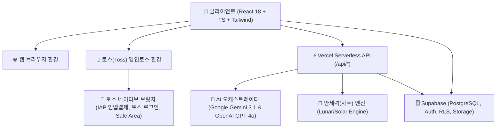

# 🤖 MBTIJU (엠비티아이주) - 에이전트 시스템 아키텍처 및 서비스 명세서 (`agent.md`)

> **문서 버전**: v1.0.0  
> **대상**: AI 코딩 에이전트 및 개발자  
> **언어**: 한국어 (Korean)  
> **목적**: MBTIJU 서비스의 전체 아키텍처, 비즈니스 로직, 데이터 모델, API 인터페이스, 상태 관리 및 개발 규칙을 명확히 정의하여 AI가 향후 기능 수정 및 확장을 일관되고 정확하게 수행할 수 있도록 지원합니다.

---

## 1. 🌟 서비스 개요 및 비전

**MBTIJU(엠비티아이주)**는 동양의 **정통 사주명리학(四柱命理學)**과 서양의 **MBTI 성격 유형 분석**을 융합하여 현대적이고 직관적인 운세 및 심층 성격 리포트를 제공하는 하이브리드 인텔리전스 서비스입니다.

### 핵심 기능 및 제공 가치
1. **사주 x MBTI 융합 분석**: 생년월일시 만세력 8자와 16가지 MBTI 성향을 교차 분석하여 기존 운세 대비 차별화된 심층 통찰 제공.
2. **멀티 플랫폼 지원**:
   - **웹 플랫폼 (Web)**: 데스크톱/모바일 반응형 웹 (Supabase Auth, 일반 PG 결제, PDF/Word 다운로드).
   - **앱인토스 (Apps in Toss, AIT)**: 토스(Toss) 슈퍼앱 내 미니앱으로 구동 (토스 로그인, 토스 인앱결제, Safe Area 대응, 네이티브 브릿지).
3. **전문가급 심층 리포트 (Deep Report)**:
   - 20~30페이지 분량의 초개인화 평생 총운 리포트 자동 생성 및 `@react-pdf/renderer` 기반 A4 규격 고해상도 PDF 다운로드 지원.
4. **다채로운 테마 운세 & 인터랙션**:
   - 신비타로 (일일/연애/커리어), 궁합 여행지 추천, KBO 프로야구 성향 궁합, 자미두수, 금전/재물/이직/창업 사주, 연애/재회/짝사랑 사주, AI 1:1 심층 상담 챗봇, 굿즈 쇼핑몰.

---

## 2. 🏛️ 전체 시스템 아키텍처



---

## 3. 📂 디렉터리 구조 및 파일별 역할 명세

```text
MBTI-Saju/
├── api/                             # [백엔드] Vercel Serverless Functions (Node.js/Edge)
│   ├── _utils/                      # 백엔드 공통 모듈
│   │   ├── ai-provider.ts           # Gemini 3.1 Flash / GPT-4o 자동 폴백 AI 팩토리
│   │   ├── cors.ts                  # CORS 및 보안 헤더 처리
│   │   ├── json.ts                  # AI 응답 JSON 안전 파싱 유틸리티
│   │   ├── prompts.ts               # 사주/MBTI 프롬프트 템플릿
│   │   ├── retry.ts                 # AI 호출 재시도 로직 (지수 백오프)
│   │   └── saju.ts                  # 백엔드 만세력 및 오행/십신 계산 엔진
│   ├── analysis-main.ts             # 메인 사주+MBTI 분석 API (성격, 운세, 전략)
│   ├── analysis-special.ts          # 특화 분석 API (작명, 취업, 여행, 체리, 기본 운세)
│   ├── chat.ts                      # AI 심층 사주 상담 챗봇 스트리밍 API
│   ├── compatibility.ts             # 1:1 심층 사주 & MBTI 궁합 분석 API
│   ├── daily_relationship.ts        # 인연별 일일 궁합 및 조언 API
│   ├── disconnection.ts             # 인연 정리 및 관계 단절 솔루션 API
│   ├── generate-and-save-report.ts  # 심층 리포트 생성 및 Supabase DB 저장 API
│   ├── generate-deep-report.ts      # 심층 리포트 섹션별 AI 생성 엔진 API
│   ├── gold.ts                      # 금전운/재물운/사업운/이직운 분석 API
│   ├── love-saju.ts                 # 연애/결혼/재회/짝사랑 사주 분석 API
│   ├── payment.ts                   # 결제 검증, 승인, 취소 및 크레딧 충전 API
│   ├── tarot.ts                     # 신비타로 AI 리딩 API (데일리/연애/커리어)
│   ├── tsconfig.json                # API 전용 TypeScript 설정
│   └── types.d.ts                   # 백엔드 전역 타입 정의
│
├── docs/                            # [문서] 플랫폼 연동 및 레퍼런스
│   ├── toss/                        # 토스 앱인토스 개발/출시/결제 가이드
│   └── llms.md                      # AI 프롬프트 지침
│
├── public/                          # [정적 자원]
│   ├── assets/                      # 3D 아이콘, 로고, 디자인 벡터, 프리미엄 썸네일
│   │   ├── designs/                 # UI 및 리포트 디자인 SVG
│   │   ├── icons/                   # 3D 렌더링 도메인 아이콘
│   │   ├── logo/                    # MBTIJU 브랜드 로고 및 모노그램
│   │   └── premium/                 # 심층 리포트 샘플 이미지
│   └── fonts/                       # 웹 폰트 파일
│
├── src/                             # [프론트엔드] React 소스코드
│   ├── assets/                      # 컴포넌트 임베딩 폰트(NotoSansKR, Nanum) 및 배경 이미지
│   ├── components/                  # 재사용 UI 컴포넌트
│   │   ├── admin/                   # 관리자 대시보드 레이아웃, 사이드바
│   │   ├── auth/                    # OAuth 및 로그인 콜백 컴포넌트
│   │   ├── pdf/                     # @react-pdf 기반 A4 심층 리포트 컴포넌트 (DeepReportReactPDF.tsx)
│   │   ├── saju/                    # 사주 4주 8자 명식표 시각화 (SajuGrid.tsx)
│   │   ├── tarot/                   # 타로 스프레드 선택기 (SpreadSelector.tsx)
│   │   ├── AnalysisModal.tsx        # 사주 & MBTI 기본 분석 결과 모달
│   │   ├── BottomNav.tsx            # 모바일 하단 내비게이션 바
│   │   ├── CompatibilityModal.tsx   # 궁합 분석 입력/결과 모달
│   │   ├── CreditPurchaseModal.tsx  # 크레딧 충전 모달 (AIT IAP 및 웹 결제)
│   │   ├── DeepReportModal.tsx      # 심층 리포트 신청 및 결제 모달
│   │   ├── FeatureGrids.tsx         # 메인 홈 기능 그리드 카드 목록
│   │   ├── HeroSection.tsx          # 홈 메인 히어로 배너 및 빠른 입력 폼
│   │   ├── Navbar.tsx               # 상단 글로벌 내비게이션 바
│   │   ├── OnboardingModal.tsx      # 신규 사용자 온보딩 사주/MBTI 입력 모달
│   │   └── ...ShareCard.tsx         # 도메인별 SNS 카드뉴스 이미지 생성기
│   ├── config/                      # 전역 설정 (크레딧 단가, Zod 스키마, 로딩 문구, KBO 설정)
│   │   ├── creditConfig.ts          # 크레딧 패키지 및 서비스별 차감 비용 (SERVICE_COSTS)
│   │   ├── loadingMessages.ts       # AI 생성 중 단계별 노출 안내 문구
│   │   ├── schemas.ts               # AI SDK 응답 검증용 Zod 스키마
│   │   └── teamConfig.ts            # KBO 구단별 메타데이터
│   ├── constants/                   # 도메인 상수 (천간, 지지, 십신, 오행 스타일)
│   ├── data/                        # 타로 78장 덱 데이터 (tarotDeck.ts)
│   ├── hooks/                       # 커스텀 리액트 훅
│   │   ├── useAuth.ts               # Supabase 사용자 인증 및 프로필 관리
│   │   ├── useCredits.ts            # 크레딧 잔액 조회, 차감, 충전 훅
│   │   ├── useModalStore.ts         # 모달 전역 오픈/클로즈 상태 관리
│   │   ├── useShopCart.ts           # 굿즈/상품 장바구니 훅
│   │   └── useSubscription.ts       # 구독 티어 및 권한 확인 훅
│   ├── pages/                       # 라우트별 페이지
│   │   ├── admin/                   # 관리자 (대시보드, 유저, 결제, 리포트, 리뷰 관리)
│   │   ├── ChatPage.tsx             # 1:1 AI 사주 상담 챗봇
│   │   ├── DeepReportLandingPage.tsx# 심층 리포트 랜딩 및 다운로드 뷰어
│   │   ├── FortunePage.tsx          # 정통 신년/종합 운세
│   │   ├── GoldPage.tsx             # 금전/재물/사업/이직 사주
│   │   ├── JamidusuPage.tsx         # 자미두수 12궁 성좌 분석
│   │   ├── KboPage.tsx              # KBO 야구단 궁합
│   │   ├── MyLuckPage.tsx           # 통합 나의 운세 허브
│   │   ├── MyPage.tsx               # 마이페이지 (내 사주 정보, 저장된 리포트, 크레딧)
│   │   ├── RelationshipPage.tsx     # 인연 관리 및 심층 궁합
│   │   ├── TarotPage.tsx            # 신비타로 카드 뽑기 및 해설
│   │   └── TripPage.tsx             # 사주 맞춤 여행지 추천
│   ├── payment/                     # 결제 추상화 레이어
│   │   ├── ait/                     # 앱인토스 SDK 인앱결제 핸들러
│   │   ├── web/                     # 웹 환경 결제 핸들러 (PortOne/PG 연동)
│   │   └── index.ts                 # 실행 환경(`isTossApp()`)에 따른 결제 라우팅
│   ├── utils/                       # 프론트 유틸리티
│   │   ├── sajuUtils.ts             # 클라이언트 만세력 계산 및 오행 점수화
│   │   ├── pdfGenerator.ts          # PDF 다운로드 트리거 유틸리티
│   │   ├── docxGenerator.ts         # Word(.docx) 다운로드 유틸리티
│   │   ├── exportUtils.ts           # html2canvas 기반 이미지 카드 저장 유틸리티
│   │   └── envUtils.ts              # AIT 환경 감지 (`isTossApp()`)
│   ├── supabaseClient.ts            # Supabase JS 클라이언트 인스턴스
│   ├── index.css                    # Tailwind + 디자인 토큰 + PDF 스타일
│   └── App.tsx                      # 글로벌 라우팅, 모달 주입 및 앱 진입점
│
├── supabase/                        # [데이터베이스] Supabase 마이그레이션 SQL
│   └── migrations/                  # 01_reviews.sql, 02_shop.sql, 03_event_claims.sql
│
├── granite.config.ts                # 앱인토스(AIT) 빌드/실행 설정
├── vercel.json                      # Vercel Serverless 배포 및 URL 리라이트
├── package.json                     # 프로젝트 패키지 및 의존성
└── .gitignore                       # Git 무시 목록 (*.ait 포함)
```

---

## 4. 🗄️ 데이터베이스 스키마 및 핵심 모델

| 테이블 명 | 주요 컬럼 | 설명 |
|---|---|---|
| `users` | `id`, `email`, `credits`, `saju_data`, `mbti`, `created_at` | 사용자 계정, 사주 정보 및 보유 크레딧 |
| `orders` | `id`, `user_id`, `product_id`, `amount`, `status`, `payment_key`, `created_at` | 결제 주문 및 충전 내역 |
| `deep_reports` | `id`, `user_id`, `report_data`, `pdf_url`, `status`, `created_at` | 생성된 초개인화 심층 리포트 전문 JSON 및 다운로드 링크 |
| `reviews` | `id`, `user_id`, `rating`, `content`, `service_type`, `created_at` | 서비스 후기 및 평점 데이터 |
| `inquiries` | `id`, `user_id`, `title`, `content`, `status`, `answer`, `created_at` | 1:1 고객센터 문의 및 관리자 답변 |
| `user_relationships` | `id`, `user_id`, `target_name`, `target_saju`, `target_mbti`, `relation_type` | 궁합 및 인연 관리 저장 데이터 |
| `chat_messages` | `id`, `user_id`, `role`, `content`, `created_at` | AI 사주 상담 대화 이력 |
| `event_claims` | `id`, `user_id`, `event_type`, `claimed_at` | 이벤트성 크레딧/리포트 수령 기록 |

---

## 5. 🔄 핵심 비즈니스 로직 및 파이프라인

### 1) 사주 및 MBTI 융합 분석 파이프라인
```text
[사용자 입력] 생년월일 + 태어난 시간 + 양력/음력 + 성별 + MBTI
     ↓
[만세력 연산] (api/_utils/saju.ts, src/utils/sajuUtils.ts)
- 천간/지지 8자 도출 (년주, 월주, 일주, 시주)
- 오행(목, 화, 토, 금, 수) 비율 및 결핍/과다 분석
- 십신(비견, 겁재, 식신, 상관, 편재, 정재, 편관, 정관, 편인, 정인) 및 신살 연산
     ↓
[AI 프롬프트 오케스트레이션] (api/_utils/ai-provider.ts)
- 1순위: Google Gemini 3.1 Flash Lite
- 폴백 체인: OpenAI GPT-4o-mini
- Zod 스키마를 통한 엄격한 JSON 구조 보장
     ↓
[크레딧 원자적 차감 & 결과 캐싱] (Supabase RPC `deduct_credits`)
- 결과 모달(`AnalysisModal.tsx`) 오픈 및 로컬/DB 저장
```

### 2) 크레딧 단가 정책 (`src/config/creditConfig.ts`)
- **무료 (0 C)**: 오늘의 운세 (`FORTUNE_TODAY`)
- **라이트 (2 C)**: 신비타로 (`TAROT`)
- **스탠다드 (5 C)**: 내일 운세, 궁합, 여행지, KBO 궁합, 재물운, 사업운, 취업운, 이직운, 연인/부부/결혼/재회/짝사랑 사주
- **프리미엄 (10~20 C)**: 재분석 (10), 자미두수 (15), MBTI & 사주 메인 분석 (20), AI 1:1 상담 5회 (20)
- **심층 리포트**: 단건 전용 패키지 결제 (`AIT_DEEP_REPORT_PRODUCT_ID`)

### 3) 결제 라우팅 및 샌드박스 대응 (`src/payment/index.ts`)
- `isTossApp()`이 `true`인 경우: `@apps-in-toss/web-framework` IAP 네이티브 SDK 호출.
- `isTossApp()`이 `false`인 경우: 일반 웹 환경 토스페이먼츠/포트원 웹 SDK 호출.

---

## 6. ⚠️ AI 코딩 에이전트 개발 수칙 (Strict Rules)

1. **플랫폼 브릿지 방어 (`isTossApp()` 필수)**:
   - 네이티브 API 호출 전 반드시 `isTossApp()`을 검사하여 일반 브라우저에서 에러가 발생하지 않도록 방어 코드를 작성하세요.
2. **비밀 키 서버 격리**:
   - `GEMINI_API_KEY`, `OPENAI_API_KEY`, `SUPABASE_SERVICE_ROLE_KEY`는 서버리스 함수(`api/`) 내부에서만 참조하고 프론트엔드 번들에 포함되지 않도록 하세요.
3. **크레딧 차감 함수 일원화**:
   - 유료 기능 실행 시 반드시 `useCredits.ts`의 `deductCredits()` 함수를 호출하여 DB 원자적 차감 및 UI 상태를 동기화하세요.
4. **엄격한 스키마 검증**:
   - AI 응답 파싱 시 `src/config/schemas.ts`의 Zod 스키마를 사용하고, 예상치 못한 필드 누락 시 안전한 폴백 데이터를 반환하도록 처리하세요.
5. **@react-pdf 렌더러 규격 준수**:
   - PDF 리포트는 브라우저 CSS 대신 React-PDF 전용 스타일 및 `NotoSansKR` 폰트를 사용하세요.
